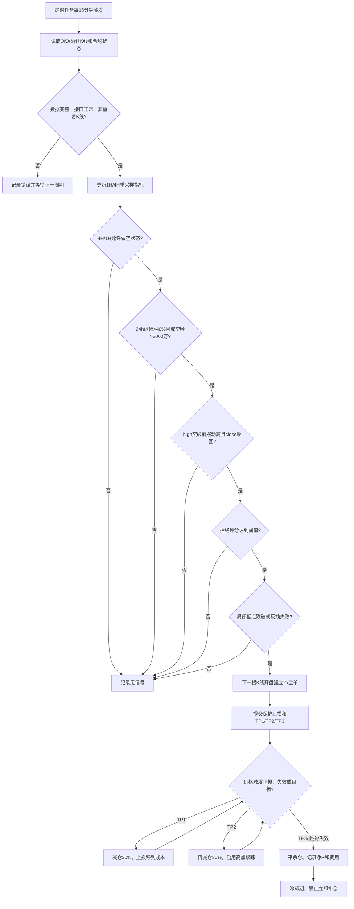

# HLSR — High-Level Liquidity Sweep Reversal

中文：高位流动性扫顶反转策略

核心公式：

> 高位价值区 + 流动性扫顶 + 拒绝 + 结构破坏 + 右侧确认 = 做空

这是一个只做空 OKX USDT 永续合约的多周期策略。15分钟K线负责触发入场，1小时和4小时K线负责判断市场状态、阻力区和目标位。核心入场模块只负责识别反转结构；仓位、杠杆、止损距离、波动率、资金费率、OI和爆仓数据属于独立的风险管理模块。策略不自动连接实盘下单；执行层必须先经过纸面交易、风险引擎和人工开关。

## 量化参数

| 参数 | 默认/搜索范围 | 定义 |
| --- | --- | --- |
| `gain_24h` | `> 40%`，硬过滤 | `close[t] / close[t-96] - 1` |
| `quote_volume_24h` | `> 30,000,000 USDT`，硬过滤 | 最近96根15分钟K线 `volCcyQuote` 求和 |
| `swing_lookback` | 6、12根 | 前一摆动高点取入场K线前N根最高价 |
| `wick_ratio` | 0.4、0.6 | 上影线长度 / K线总振幅 |
| `volume_multiple` | 1.0、1.5 | 当前成交额 / 前20根平均成交额 |
| `minimum_rejection_score` | 1、2 | 上影线、阴线、放量、深度失败突破四项满足数 |
| `reject_depth_atr` | 0.1 | 第 4 项"失败突破"的深度阈值（× ATR14），必须大于 0 |
| `confirmation_window` | 4、8根 | sweep后等待结构确认的最长K线数 |
| `stop_atr` | 0.25、0.5 | 止损 = sweep high + ATR(14)×倍数 |
| `trail_bars` | 2 | TP2后使用最近N根高点跟踪 |
| `allow_range` | true/false | 是否允许1H/4H处于区间状态 |
| `leverage` | 2x | 只影响保证金占用，不改变单笔风险预算 |

单笔账户风险建议固定为权益的0.25%至0.5%。策略不会因杠杆改变止损距离，也不会向亏损仓位加仓。

## 触发条件

1. **市场状态**：4H和1H数据被重采样得到。4H `close < EMA20 < EMA50` 为 bearish；均线不一致且区间宽度较小为 range。只允许 bearish，或在 `allow_range=true` 时允许 range。
2. **高位区域**：4H最近20根最高价为 `recent_high`，ATR为波动尺度。`resistance = recent_high + 0.25 × ATR`。当前价按距离阻力划分 normal extension、primary sweep、extreme sweep。
3. **硬筛选**：15分钟滚动96根涨幅必须大于40%，报价成交额必须大于3,000万 USDT。
4. **流动性扫高**：`high[t] > previous_swing_high` 且 `close[t] < previous_swing_high`。
5. **拒绝确认**：以下四项中至少满足配置的数量：上影线比例达标、阴线、成交额放大、深度失败突破（收盘比前高低出 `reject_depth_atr × ATR14`，不能只重复"收盘回到前高下方"这一与扫顶重复的条件）。
6. **结构确认**：sweep后的确认窗口内，出现 `break_of_local_low` 或 `failed_retest`。确认K线收盘后，在下一根15分钟K线开盘做空。
7. **止损**：初始止损高于 sweep high；若价格收盘重新站上 sweep high，立即退出。跳空时按下一根K线开盘价处理。
8. **止盈**：TP1为确认前局部支撑，TP2为4H区间中点，TP3为4H最近20根主要低点；若结构目标不在入场价下方，则退回1R、2R、3R保护目标。
9. **持仓管理**：TP1/TP2/TP3按30%/30%/40%分批；TP1后止损移到开仓价；TP2后按最近2根高点向下跟踪；退出后冷却16根15分钟K线，不立即平均加仓。

## 自动化执行流程



## 回测

```bash
python3 strategies/hlsr/src/high_short_strategy.py \
  --symbols 50 \
  --days 180 \
  --end 2026-09-26T19:00:00+00:00
```

脚本执行三个滚动窗口：60天训练、30天验证、30天测试。结果按需写入 `strategies/hlsr/results/`；报告中的 `passed` 需要同时满足：样本外至少 30 笔、胜率严格高于 50%、实际收益/风险至少 2.0、bootstrap 正期望概率高于 50%、平均净 R 为正。`passed` 不作为运行时数据提交。
