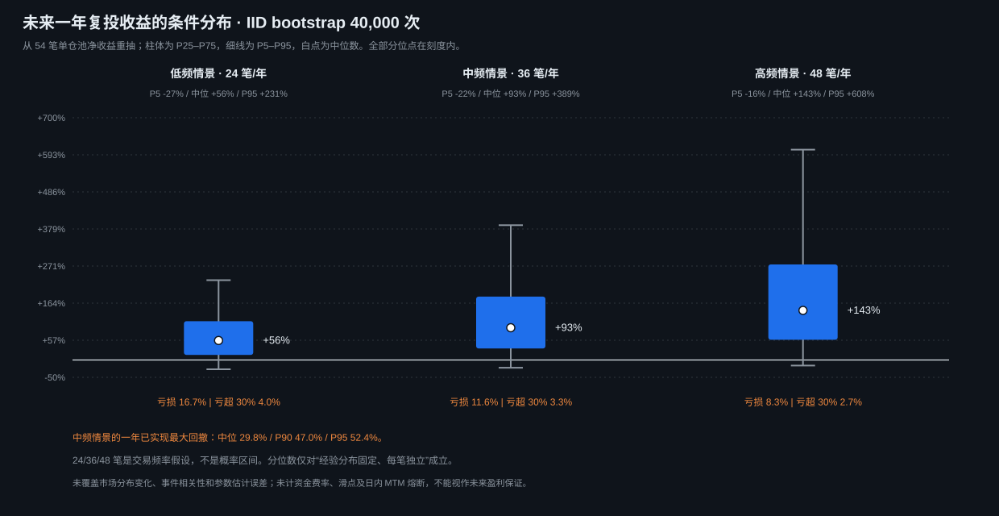

# 山寨币二次扫顶

山寨币二次扫顶，策略实验室规则版本 1.4，已同步到 `StrategyType.sweepReversalShort` 和 `Sources/TradingService/StrategyEngine.swift`。

全历史生产单仓 54 笔，平均净收益 +0.453R，资金池已实现盈亏复投终值 2.720x；已实现最大回撤 43.49%，手续费单边 5bp，未计资金费和滑点。规则定稿与收益为正均有历史证据，但预测仍有亏损区间。

完整说明、年度盈利分布预测和带下单/止损/止盈标记的真实 K 线案例均集中在 [`STRATEGY.md`](STRATEGY.md)：

- [信号与风控](STRATEGY.md#2-信号判定1h-结构--15m-确认)：1h 两次扫顶、BTC 门控、15m 确认后下单。
- [盈利分布与条件预测](STRATEGY.md#8-盈利分布与条件预测)：54 笔单仓复投、年度分位、亏损概率、成本敏感性及回撤。
- [典型 K 线与点位](STRATEGY.md#9-典型-k-线下单与保护点位)：FET 止盈、ONT 止损、BAT 96 小时时间退出。
- [执行检查与失效监测](STRATEGY.md#10-执行检查与失效监测)：数据、成交、保护单、熔断和复核。



- 稳定策略标识：`sweepReversalShort`（`StrategyType.identifier`，程序匹配和路由使用）
- UI 显示名称：`山寨币二次扫顶`（`StrategyConfig.displayName`，修改文案不影响程序标识）

- 集成规则：[`STRATEGY.md`](STRATEGY.md)
- **上线规则绩效证据**：[`research/report_live_rule.py`](research/report_live_rule.py)（177 币基线 39 笔 / 56.4% / +0.41R，逐笔与 `research/live_signal.py` 对齐；`--pool live` 复现生产选币范围：47 笔 / 48.9% / +0.32R，单仓 24 笔 +13.45R，见 [`STRATEGY.md`](STRATEGY.md) §5）
- **全历史复核（18 个月，含新样本外）**：[`research/report_full_history.py`](research/report_full_history.py)（生产范围 108 笔 / 50.0% / +0.31R，新样本外 56 笔 +0.28R；全池仓位折算终值 2.72x、回撤 43.5%，见 [`research/STRATEGY_SPEC.md`](research/STRATEGY_SPEC.md) §7.7）
- **盈利预测和 K 线图生成**：[`research/profit_projection.py`](research/profit_projection.py)；统计见 [`results/full_history/profit_projection.json`](results/full_history/profit_projection.json)，六张图见 [`results/full_history/charts/`](results/full_history/charts/)。研究入口、输出和历史口径说明见 [`research/README.md`](research/README.md)。
- 研究材料和实验配置：[`research/`](research/)
- 执行与触发时机调优记录：[`research/EXECUTION_TUNING.md`](research/EXECUTION_TUNING.md)
- 中低流动性币专项调优：[`research/LOWMID_TUNING.md`](research/LOWMID_TUNING.md)
- 中低流动性币滚动验证：[`research/LOWMID_FOLLOWUP.md`](research/LOWMID_FOLLOWUP.md)
- 调优脚本：`research/tune_execution.py`、`research/run_grid.py`、`research/lowmid_followup.py`
- 研究层因果性回归测试：[`tests/test_causal_research.py`](tests/test_causal_research.py)；运行 `python3 -m unittest discover -s strategies/sweep_reversal_short/tests -p 'test_*.py'`（需要研究引擎的 pandas 依赖才能执行指标测试）
- 盈利预测回归测试：[`tests/test_profit_projection.py`](tests/test_profit_projection.py)，覆盖完整一年窗口、初始亏损回撤、分桶边界、跳空/时间出场价、离场月份与覆盖期年化；同一测试命令执行。
- 集成配置：[`config/strategy.json`](config/strategy.json)
- 回测输出和标的池：`results/`

研究脚本从 `data/kline/okx/swap/5m` 读取 K 线，派生数组和结果写入本目录的 `results/`。生产执行只使用 Swift 源码，不读取研究目录。

生产扫描范围固定为 `dynamic.sweepCandidates`（v1.4）：每 30 秒刷新行情，排除主流币、稳定币及非加密资产，再剔除 24h 报价成交额低于 300 万 USDT 的合约后，按成交额取前 100 个；报价成交额按 OKX ticker 的 `volCcy24h × last` 计算，不使用以张计的 `vol24h`。策略不保存固定币种名单。策略运行时扫描多个币种，但同一实例只允许一个币种下单和持仓。`config/universe_recommended.json` 的 177 个标的是历史回测快照，只用于复现研究结果。

当前同步范围包含 1h 结构、15m 收盘确认、市价入场、全池名义仓位、15% 止损距离上限、条件止损/止盈、96 根 1h（384 根 15m）时间离场和账户级固定 5% mark-to-market 日内熔断；策略入场不再使用固定数量。新建实例的资金池上限由 `5% ÷ 15%` 推导，当前不超过 33.33%。

每个入场订单的名义仓位 = 授权时本策略资金池可用余额 × 1，没有按止损距离反推的风险预算；单笔最坏亏损就等于止损距离占入场价的比例，止损距离超过 15% 的信号不下单。资金池占账户的比例受固定 5% 账户熔断和 15% 单笔止损上限共同约束，当前最大约 33.33%；杠杆只影响保证金占用。策略自带 `扫顶期间最高价 + 0.5 × ATR14` 的动态止损，界面只展示该规则，不另设固定止损百分比。已实现盈亏才回写本池滚仓，未实现浮盈不释放可用余额。

修改策略时先更新 `STRATEGY.md` 与 `config/strategy.json`，再同步 `Sources/`；运行 `python3 scripts/validate_strategy_sync.py` 验证同步状态。

## 重建说明书证据

```bash
python3 strategies/sweep_reversal_short/research/report_full_history.py
python3 strategies/sweep_reversal_short/research/profit_projection.py
python3 -m unittest discover -s strategies/sweep_reversal_short/tests -p 'test_*.py'
python3 scripts/validate_strategy_sync.py
swift test
git diff --check
```

全历史轻量报告和图表保留在 `results/full_history/`；同目录的 `data/` 为可重建派生缓存。历史快照 108 笔信号与正式单仓 54 笔的口径必须分开。图中时间均为 UTC，CSV bar 时间戳是开盘时间；实际入场发生在确认 bar 收盘之后。
