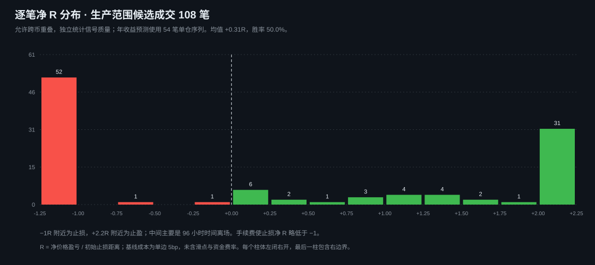
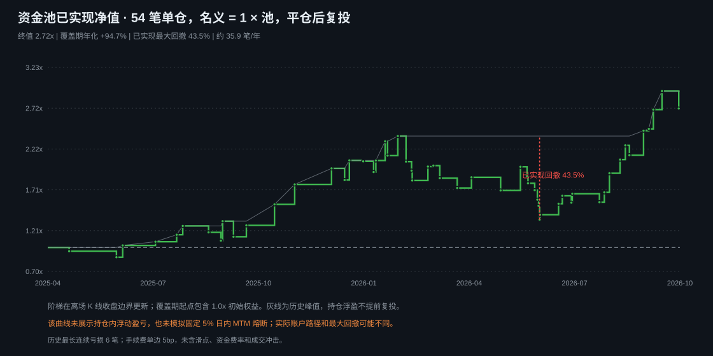
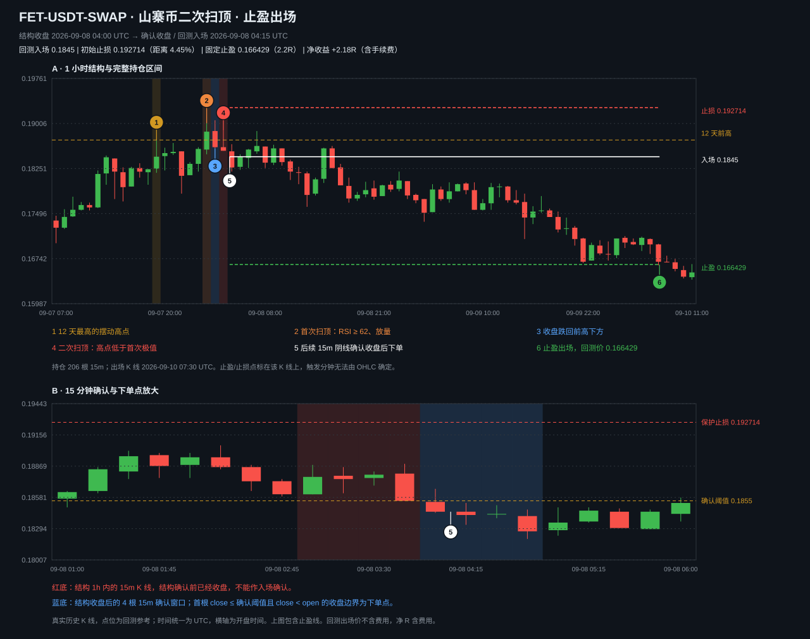
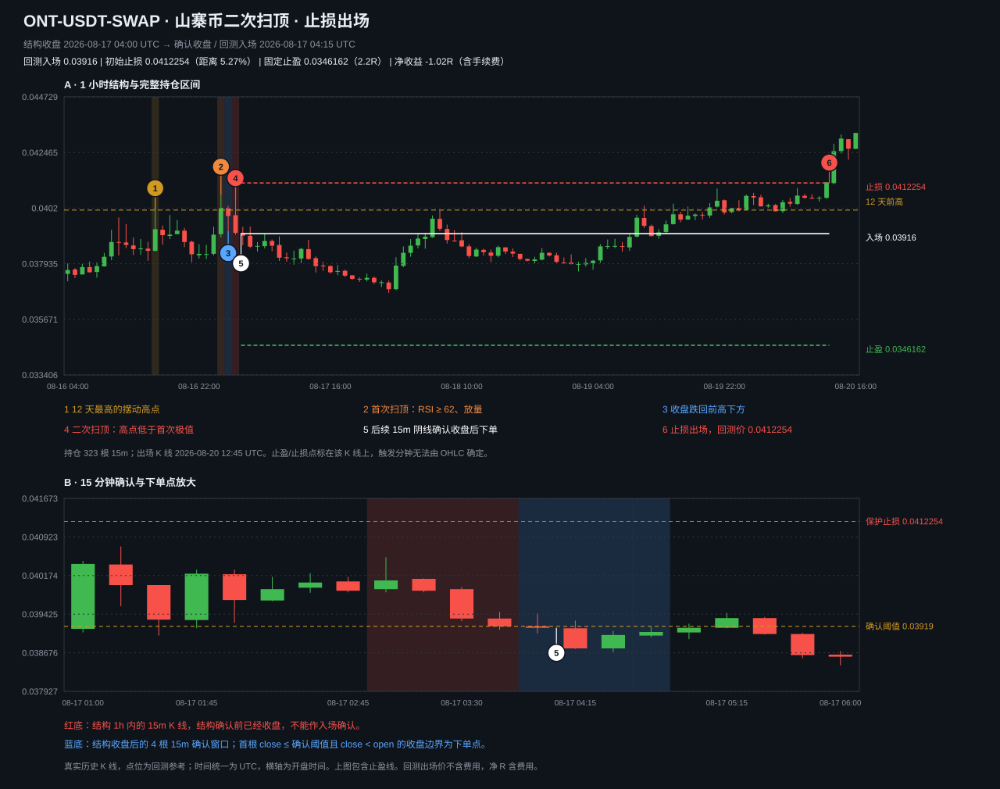
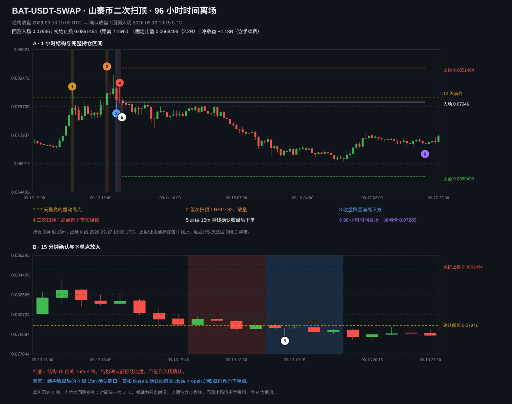

# SWEEP_REVERSAL_SHORT 山寨币二次扫顶

版本：1.4（策略实验室定稿；已同步到 NovaTrade 策略引擎，`StrategyType.sweepReversalShort`）
规则真源：本目录的 `STRATEGY.md`；机器参数真源：`config/strategy.json`。研究结果不能反向定义规则。
中文显示名：山寨币二次扫顶（7 字）；稳定标识和英文标识不因改名变化。
市场：OKX USDT 线性永续合约 · 1 小时结构 + 15 分钟入场确认
用途：行情扫描与信号生成；信号附带 ATR 标定的止损/止盈价位，可接入运行时下单流程。运行时按连接账号类型路由 OKX 模拟或实盘。
当前集成状态：v1.4 已同步 1h 结构、15m 收盘确认、市价入场、动态范围、全池名义仓位（资金池可用余额 × 1）、15% 止损距离上限、条件止损/止盈保护单、96 根 1h 时间离场和账户级固定 5% mark-to-market 日内熔断；账户级处置失败会写入 warning 日志并保持熔断锁存。

截至 2026-10-03 的完整历史复核方向为正：生产范围全部有效成交 108 笔，平均净收益 +0.312R；按正式实例单仓限制取 54 笔，已实现盈亏复投后资金池终值 2.720x（+172.0%）。同一序列的已实现最大回撤为 43.5%，较早未参与调参区间的均值置信区间跨零。正式定稿表示规则和运行时已经同步，不表示未来每月盈利或风险已经消失。

阅读入口：规则与参数见 §1–4，历史证据见 §5，运行时映射见 §6；收益分布及条件预测见 §8，真实 K 线案例与点位计算见 §9，执行检查与失效监测见 §10，复现和证据文件见 §11。

## 1. 核心逻辑

> 12 天最高点被连续两次假突破（扫顶）且收盘回落 + 多头衰竭确认 + 大盘 BTC 门控 = 做空信号

生产运行时每 30 秒刷新一次 OKX 行情，先排除主流币、稳定币、股票/指数/商品类标的，再剔除 24h 报价成交额低于 **300 万 USDT** 的合约，然后按 24h 报价成交额降序取前 **100** 个 USDT 线性永续山寨币（`dynamic.sweepCandidates`）。24h 报价成交额 = OKX ticker 的 `volCcy24h`（以币计）× `last`，是 USDT 计价的近似值；不得使用以张计的 `vol24h`，缺少 `volCcy24h` 时按 0 处理、不进入范围。这些标的随榜单变化，不是固定名单；策略扫描多个币种，但同一实例只允许选择一个币种提交入场单并持有；BTC 只作门控参考，不交易 BTC 本身。

v1.4 变更：生产扫描范围由 v1.3 的 `dynamic.hotAltcoins`（成交额前 20）改为 `dynamic.sweepCandidates`（成交额前 100 且 ≥300 万 USDT）；信号、确认、出场与风控参数不变。改动依据见 §5「生产选币范围证据」：前 20 口径在历史样本上为负期望，策略收益主要来自热门榜之外、仍有一定成交额的山寨币，这与 177 币历史基线的结论一致。

历史回测使用 `config/universe_recommended.json` 的 177 个标的作为可复现快照基线。该快照只用于研究证据，不能作为生产绑定范围；生产范围的因果复现见 §5 的 `--pool live`。

## 2. 信号判定（1h 结构 + 15m 确认）

**时间基约定（唯一口径）**：所有 K 线时间戳都是该 K 线的**开盘时间**（OKX `ts`），不是收盘时间。因此 1h 结构 bar 的收盘时刻 = 该 bar 时间戳 + 60 分钟；15m 确认窗口从**结构 bar 的收盘时刻**起算，第一根可确认的 15m bar 是时间戳等于「结构 bar 时间戳 + 60 分钟」的那一根。结构 bar 自身那一小时内的 15m K 线（+15 / +30 / +45 分钟）在结构收盘前就已收盘，**不得**作为确认依据。

1. **高位摆动高点**：`high[p]` 是最近 **288 根（12 天）最高价**，且左 10 根严格更低、右 5 根不低于（L=10, R=5）。
2. **首次扫顶**：p 之后 96 根内首次出现 `high[s] > high[p]`，且 5 根内收盘跌回该价位下方（k1）。要求扫顶时 `RSI14[s] ≥ 62` 且 `volume[s] ≥ 1.5 × 48 根均量`。
3. **二次扫顶（核心）**：k1 之后 12 根内再次 `high[j] > high[p]` 且收盘回落。要求：
   - 二次高点低于首次扫顶极端价（`high[j] < max(high[s...k1])`，多头衰竭）；
   - 上穿深度 `high[j] − high[p] ≥ 0.2 × ATR14[j]`。
4. **BTC 门控**：二次扫顶 1h bar 收盘时取时间不晚于结构时刻的最近一根 BTC 1H 收盘，要求 `BTC 收盘 < BTC SMA200(1H)`；历史不足 200 根或缺少可对齐 BTC bar 时门控关闭。
5. **15m 收盘确认**：二次扫顶 1h bar 收盘后，最多等待 1 小时（后续 4 根 15m，时间戳依次为结构 bar 时间戳 +60/+75/+90/+105 分钟）。第一根满足 `close <= 1h 二次扫顶收盘价` 且 `close < open` 的已确认 15m 阴线才触发入场；没有确认则取消该结构，不追单。
6. **入场**：15m 确认 K 线收盘后立即使用市价做空；不是埋伏限价单。

## 3. 出场与风控（随信号下发）

- 止损：仍使用 1h 扫顶期间最高价 `ext + 0.5 × ATR14[j]`；
- 止盈：以确认 15m 收盘参考价计算 `入场参考价 − 2.2 × (止损 − 入场参考价)`；当前运行时提交信号生成时的保护价，没有在实际成交后按成交均价重算，成交滑点会改变实际风险距离和实际盈亏比；
- 时间离场：入场后 96 根 1h（等价 384 根 15m）未触发则收盘平仓；
- 薄盘/极端波动保护：`ATR/价格 < 0.5%` 或 `止损距离 > 5 × ATR` 不发信号；
- **仓位 = 用满资金池**：每个入场订单的名义仓位 = 授权时本策略**资金池可用余额 × 1**（`sizing=full_pool_available_capital`，`notional_pool_multiple=1.0`）。没有按止损距离反推的风险预算，也没有 `risk_per_trade_pct`；资金池占账户的比例是唯一的仓位旋钮。杠杆只决定保证金占用，不放大名义仓位。冷却 96 根。
- **单笔最坏亏损 = 止损距离**：名义倍数为 1 时，止损触发的亏损占资金池的比例就等于 `abs(止损价 − 入场价) / 入场价`。执行层规定**止损距离超过 15%（`max_stop_distance_pct=15`）的信号不下单**，因此单笔最坏亏损被封顶在资金池权益的 15%；这是执行保护，不是信号参数，与 `max_risk_atr` 的 5×ATR 信号过滤并存。
- 亏损预算不含成交成本：实际成交会受跳空、滑点、手续费和资金费率影响，账户熔断按含这些项目的 mark-to-market 权益计算。策略已经自带动态止损，用户不另设固定单笔止损百分比；止损距离由 `扫顶期间最高价 + 0.5 × ATR14` 与入场价在每个信号上计算。
- 已实现盈亏回写策略记账池后滚仓，未实现浮盈不释放可用余额。
- 策略实例最多保留一个活动币种；扫描到其他币种的同时信号时，只记录信号并由策略级并发限制拒绝下单。

### 账户级总风控（优先级高于本策略）

- 每日基线是 UTC 日界开始时的全账户权益；权益按已实现盈亏、未实现盈亏、手续费和资金费率实时 mark-to-market。
- 当日权益相对日初权益亏损达到 **5%**（`dailyPnLPercent <= -5`，生产 `RiskLimits.productionDailyLossPercent` 固定值）时，立即锁存账户熔断：停止所有策略实例、取消未成交开仓单、对所有持仓提交 reduce-only 平仓，并写入熔断和处置日志。
- **余量要求**：固定 5% 熔断阈值必须**高于**各启用策略「资金池占比 × 15%」之和，否则一笔正常的不利波动会在止损之前触发熔断并锁死账户。运行时在创建、更新和启动启用策略时校验这条不等式；扫顶策略的资金池上限约为 `5% ÷ 15% = 33.33%`，UI 和服务端都执行该上限。
- 累计回撤熔断默认关闭（`maxDrawdownPercent = 0`）：它以历史权益峰值为基准且无法复位，和全池仓位叠加会在一次普通连亏后永久锁死账户。
- 熔断当日不自动恢复；策略自身的止损、止盈和时间离场只在账户熔断未触发时执行。

### 策略资金池

- 每个策略实例拥有独立资金池，按实例配置的资金池比例从账户权益分配；资金池之间禁止借用或互相抵扣。
- 资金池可用余额 = 池权益 − 开仓占用；未实现浮盈只用于账户级熔断和展示，不增加可用余额。
- 平仓后的已实现盈亏回写本策略池权益，下一笔按最新池权益重新计算仓位（利润复投、亏损缩小），不允许超池借贷。
- 当前策略实验室默认杠杆为 **2 倍**；新建策略实例可在 1–100 倍范围调整。杠杆只影响保证金占用，不改变名义仓位（始终是资金池可用余额 × 1），也不改变单笔亏损。

## 4. 引擎参数（StrategyConfig.parameters）

| 参数 | 默认 | 说明 |
|---|---|---|
| L / R | 10 / 5 | 摆动点左右臂 |
| majorWindow | 288 | 高位窗口（12 天）|
| sweepWait / rejectWait / resweepWait | 96 / 5 / 12 | 各阶段等待窗口 |
| rsiMin | 62 | 首次扫顶 RSI 下限 |
| volMult | 1.5 | 首次扫顶量能倍数 |
| rsDeep | 0.2 | 二次扫顶上穿深度（×ATR）|
| atrPeriod | 14 | ATR/RSI 平滑周期 |
| bufATR | 0.5 | 止损缓冲（×ATR）|
| tpMult | 2.2 | 止盈 = 2.2R |
| minATRPct | 0.5 | 最小波动过滤（%）|
| maxRiskATR | 5.0 | 最大止损距离（×ATR）|
| btcGateEnabled | 1 | BTC<SMA200 门控（0=关）|
| entryTimeframeMinutes | 60 | 结构周期（1h）|
| confirmationTimeframeMinutes | 15 | 入场确认周期 |
| confirmationWindowMinutes | 60 | 从结构 bar **收盘时刻**起算的最大确认等待（半开区间，恰好覆盖后续 4 根 15m）|

## 5. 回测绩效（历史基线：2026-03-31 ~ 2026-09-27，177 币快照）

以下数字**只对已上线规则**（1h 结构 + 15m 收盘确认 + 市价做空，含薄盘/极端止损过滤、15% 止损距离上限与 BTC 门控 fail-closed）成立，由 `research/report_live_rule.py` 逐条复现，并与 `research/live_signal.py` 的成交逐笔对齐（入场价、止损价完全一致）：

- 54 个结构 → **39 笔**（12 个结构没有等到 15m 确认，1 个被 5×ATR 极端止损过滤挡下，2 个因止损距离超过 15% 不下单）；成功率 **56.4%**；盈亏比 **1.59R**；期望 **+0.41R/笔**；
- 训练段（04-01~07-28）17 笔 47.1% +0.30R / 测试段（07-29~09-27）22 笔 63.6% +0.49R；
- 最大回撤 **3.08R**；最大连亏 **4 笔**；TP/SL/时间离场 = 23%/36%/41%；
- 0.1%/边 手续费假设下期望 **+0.39R/笔**（回撤 3.16R）；
- 月度：04 3 笔 **−1.02R** / 05 +0.60R / 06 +1.10R / 07 **−0.18R** / 08 +0.57R / 09 +0.33R——**并非每月正期望**，4 月与 7 月为负；
- 更早一版（止损距离上限引入前）为 41 笔 / 56.1% / +0.37R / 回撤 4.09R，被上限挡下的 2 笔都是止损出局，口径差异仅此而已；
- 全池对照（295 币）：73 笔、50.7%、盈亏比 1.54、期望 +0.28R/笔、回撤 4.06R。

**BTC 门控必须是 fail-closed**：信号时刻之前不足 200 根 1h K 线、或 SMA200 不可用时门控不通过（与 `btcGateAllows` 一致）。数据开头的 8 天因此被排除——此前证据脚本用 `min_periods=1` 的均线判门控，把这段历史算成"门控开"，虚增了 6 笔成交（62 结构 / 47 笔 / +0.39R 那组数字已作废）。

复现：
```bash
python3 strategies/sweep_reversal_short/research/report_live_rule.py            # 177 币基线
python3 strategies/sweep_reversal_short/research/report_live_rule.py --fee 0.001
python3 strategies/sweep_reversal_short/research/report_live_rule.py --pool all
python3 strategies/sweep_reversal_short/research/report_live_rule.py --pool live   # 生产选币范围
python3 strategies/sweep_reversal_short/research/report_live_rule.py --pool live --fee 0.001
```
输出写入 `results/live_rule_report.json`、`results/live_rule_trades.csv`，`--pool live` 写入 `results/live_rule_report_live_fee5bps.json` 等带后缀文件（该目录已被 `.gitignore` 忽略，需要时按上述命令重建）。

### 生产选币范围证据（v1.4，`--pool live`）

`--pool live` 只使用通过运行时资产类别过滤的 277 个山寨币（`live_signal.eligible_runtime_alt`，与 `StrategyUniverseRules` 的主流币、稳定币和非加密排除一致），在每个二次扫顶结构 bar 收盘时刻按滚动 24h 报价成交额（1h K 线报价成交额求和）因果排名，只保留成交额 ≥300 万 USDT 且排名 ≤100 的结构。该窗口截止于结构 bar 开盘（可用的最后一根即结构 bar 本身），运行时读到的是扫描时刻的回溯 24h，最多少个 1h bar；两种口径都不使用未来数据。成本只含 0.05%/边 手续费，未含滑点：

- 101 个结构 → **47 笔**（24 个无 15m 确认，2 个被 5×ATR 极端止损过滤，8 个因止损距离超过 15% 不下单，20 个不在生产范围）；胜率 **48.9%**；盈亏比 **1.71R**；期望 **+0.32R/笔**；最大回撤 **4.06R**；
- 训练段 27 笔 44.4% +0.22R / 测试段 20 笔 55.0% +0.46R；0.1%/边 手续费下期望 +0.30R/笔；
- 月度期望：04 3 笔 **−1.02R** / 05 11 笔 +0.06R / 06 9 笔 +0.75R / 07 6 笔 +0.34R / 08 8 笔 +0.48R / 09 10 笔 +0.49R；
- 单仓口径（同一实例只持有一个币种，前一笔未平仓时后续信号被拒绝）：24 笔、54.2%、合计 **+13.45R**、回撤 6.11R、最长连亏 6 笔；训练 15 笔 +3.13R / 测试 9 笔 +10.32R。按全池仓位折算（名义 = 1 × 池，单笔亏损 = 止损距离），这 24 笔的资金池路径见 §5 末尾的说明。

同一口径下的范围对照（0.05%/边，含 15% 止损距离上限，合计为逐笔 R 之和）：

| 范围 | 笔数 | 期望/笔 | 训练 / 测试期望 | 合计 | 单仓合计 |
|---|---:|---:|---:|---:|---:|
| 前 20（v1.3 生产范围） | 15 | +0.13R | −0.10R / +0.33R | +1.92R | +0.74R |
| 前 50 且 ≥300 万 | 26 | +0.16R | −0.03R / +0.32R | +4.04R | +9.14R |
| 前 75 且 ≥300 万 | 42 | +0.33R | +0.21R / +0.47R | +13.69R | +14.80R |
| **前 100 且 ≥300 万（v1.4）** | **47** | **+0.32R** | **+0.22R / +0.46R** | **+15.15R** | **+13.45R** |
| 前 100 且 ≥500 万 | 36 | +0.42R | +0.43R / +0.40R | +14.94R | +17.56R |
| 不限排名、不设下限 | 67 | +0.25R | +0.13R / +0.37R | +16.84R | +7.57R |

历史上满足 300 万 USDT 下限的合规山寨币每小时中位数为 93 个（10%–90% 分位 72–114 个），约 31% 的小时会被前 100 上限截断；样本内排名 100 以后、仍 ≥300 万的结构没有成交，因此上限 100 主要用于限制运行时行情订阅数量。

局限：样本只有约六个月、47 笔，月度并非全正；单仓结果依赖信号先后顺序，对范围边界敏感（前 75 与前 100 的单仓合计并不单调）；300 万 USDT 量级的合约盘口较薄，实际滑点可能明显高于回测假设；历史成交额由 1h K 线求和，运行时用 ticker `volCcy24h × last` 近似，两者在剧烈波动时会有差异。

**全池仓位折算（2025-04 至 2026-10 全历史复核，生产口径单仓）**：按名义 = 1 × 资金池、单笔亏损 = 止损距离、已实现盈亏滚仓折算，18 个月单仓序列（54 笔，新样本外 2025-04 至 2026-03 为 29 笔 +0.32R/笔）终值约 2.72x、最大回撤约 43.5%、单笔最大亏损 14.6%、亏损中位 6.4%；同一序列若按旧的固定 10% 风险预算折算为 6.67x / 54.9%。全池仓位的收益更低、回撤也更低，差异在样本噪声内，选它是为了程序简单。复核脚本：`research/report_full_history.py`（从全量 5m 独立折叠到 `results/full_history/data`，不覆盖上面 177 币快照用的 `results/data`）；报告与逐笔 CSV 已提交在 `results/full_history/`，同目录的预处理数组按 `.gitignore` 忽略、可重建。范围口径与 §5 的 `--pool live` 有一处差异：它取数据里**全部**通过运行时资产类别过滤的山寨币（279 个，含 v1.4 定稿后上市的合约），不限于 `universe.json` 的 295 币快照，因此笔数更多。

| 区间 | 笔数 | 胜率 | 期望/笔 | 合计 | 最大回撤 |
|---|---:|---:|---:|---:|---:|
| 新样本外 2025-04-03 ~ 2026-03-30 | 56 | 48.2% | +0.28R | +15.87R | 5.50R |
| v1.4 研究窗口 2026-03-31 ~ 2026-09-27 | 47 | 51.1% | +0.37R | +17.53R | 4.43R |
| 窗口之后 2026-09-28 ~ 2026-10-03 | 5 | 60.0% | +0.06R | +0.29R | 1.02R |
| 全部 | 108 | 50.0% | +0.31R | +33.68R | 7.76R |

新样本外 56 笔的 bootstrap 95% 区间为 −0.08R ~ +0.66R（20,000 次重抽，均值不大于零的概率 6.4%），即样本外方向为正但区间跨零。单仓口径 54 笔、期望 +0.45R，新样本外 29 笔 +0.32R。

**已作废的口径**：更早本节引用的"60 笔 / 51.7% / 1.69R / +0.37R / 回撤 7.9R / 月度全正"来自 `research/final_report.py` 的 **1h 收盘市价**基线，它的入场是"二次扫顶 1h bar 收盘价"，不是已上线规则的 15m 确认入场。两组数字不是同一条规则，旧数字不得再作为本策略的证据引用。

研究规则与配置：`research/STRATEGY_SPEC.md`；回测输出按需写入 `results/`。

## 6. 系统集成说明

- 引擎：`Sources/TradingService/StrategyEngine.swift` 的 `evaluateWithConfirmation`，1h 结构和 15m 确认分开缓存；15m 确认窗口的半开区间起点是 `结构 bar 时间戳 + entryTimeframeMinutes`，即结构 bar 的收盘时刻（K 线时间戳为开盘时间）；研究 Python 引擎用于历史基线验证，二者的参数映射由同步校验脚本检查；
- 门控数据：`PaperTradingStore.evaluate` 缓存 BTC 1H K 线并传入引擎；BTC 门控按 1h 结构时刻对齐；
- 评估幂等：冷却与指标只在一根**新的**已确认 K 线上推进（引擎记录 `lastEvaluatedBar`）。前端刷新图表会经 REST 用同一根 K 线重复评估，重复评估不得消耗冷却，否则冷却会被读操作提前烧完；
- 标的隔离：状态按「策略 + 标的」保存，1h 结构事件只返回该标的自己的状态，缺失时返回中性状态而不回退到全局汇总状态；提交前必须校验信号确实属于当前标的，禁止跨标的取用信号；
- 信号：`StrategySignal.stopPrice / takePrice` 携带止损止盈价位；
- 执行边界：1h 收盘只建立结构，15m 确认收盘才下单：先检查止损距离 ≤ 15%，再以资金池可用余额 × 1 为目标名义换算张数并提交市价单，订单附带条件止损/止盈；策略订单只受自己的资金池约束，账户级名义/保证金上限只作用于非策略订单；策略监控执行 96 根 1h（384 根 15m）时间离场；账户按 UTC 日界计算 mark-to-market 日损，达到固定 5% 时停止全部策略、撤销开仓挂单并对远端持仓发出平仓；创建、更新和启动时校验资金池占比不超过 `5% ÷ 15%` 的策略上限。
- UI：新建策略对话框先从策略卡片选择"山寨币二次扫顶"，再配置 USDT 资金池和 1–100 倍杠杆；资金池滑块上限由固定 5% 账户熔断和 15% 止损上限计算，当前不超过 33.33%；币种范围由规则固定为 `dynamic.sweepCandidates`（24h 报价成交额前 100 且 ≥300 万 USDT 的合规山寨币），不能手动指定。运行时扫描多个币种，但每次只允许一个币种下单/持仓；
- 后台按动态榜单刷新目标，并保留 BTC-USDT-SWAP 1H 门控数据；缺少可对齐 BTC bar 时不发新信号。

**已知执行与历史口径差异**：当前运行时的时间离场从 `order.requestedAt` 计时，而该字段保存的是信号确认 bar 的开盘时间；下单在确认 bar 收盘后，所以相对“实际入场后 96 小时”的研究口径可能提前至少 15 分钟，再加订单处理延迟。保护价按确认收盘参考价生成，不按最终成交均价重算。下面的盈利预测和 K 线展示研究规则的成交序列，不能称为已逐笔重放当前实盘订单生命周期；同步校验验证版本与参数映射，不覆盖上述执行时间差异。

## 7. 同步流程

1. 先修改本目录的 `STRATEGY.md` 和 `config/strategy.json`，必要时再更新 `research/` 的验证脚本与结果。
2. 根据新版本规则修改 `Sources/` 和 `Tests/`，把参数名映射写进同步记录；运行时代码不得读取本目录文件。
3. 执行 `python3 scripts/validate_strategy_sync.py`、策略研究测试和 `swift test`，确认实现与实验室版本一致后再提交。
4. 禁止先改 `Sources/` 再倒推修改实验室文档；研究结果只能作为证据，不能覆盖已定稿规则。

## 8. 盈利分布与条件预测

### 8.1 三种数字分别表示什么

历史报告中 `1R = 初始止损价 − 确认收盘入场参考价`，是价格距离，不是账户固定百分比。每笔净 R 包含双边手续费，理论止盈是 +2.2R，净值略低于 +2.2R；正常止损约为 −1R，计费后可低于 −1R。开盘跳过保护价时按开盘价结算，亏损可能进一步扩大。实盘应另外记录实际成交均价与保护价的距离，不能把存在滑点的实盘结果直接当成报告里的 2.2R。时间离场可以盈利，也可以亏损。

生产范围的 **108 笔**用于判断选币和信号质量；其中有相互重叠的持仓，不能把所有收益一起复投。正式实例只允许一个活动币种，按时间顺序保留的 **54 笔**才是资金池路径和年度预测的依据。177 币固定快照、生产动态范围与单仓序列是三种不同口径，不能互换。

全池名义仓位下，单笔池收益 `r_i = 净R_i × (止损价_i − 入场价_i) / 入场价_i`；第 n 笔平仓后的池净值为 `∏(1+r_i)`。手续费基线为单边 5bp（0.05%），**未计资金费和滑点**。2 倍杠杆只改变保证金占用，不把上述收益再乘 2。

| 已实现单仓历史指标 | 结果 |
| --- | ---: |
| 成交数 / 胜率 | 54 笔 / 53.7% |
| 平均净 R / 合计净 R | +0.453R / +24.45R |
| 平均盈利 / 平均亏损（R） | +1.673R / −0.962R |
| 单笔池收益算术均值 / 几何均值 | +2.31% / +1.87% |
| 最大单笔亏损 / 亏损中位数 | −14.56% / −6.38% |
| 止损距离中位数 / 第 90 分位 | 6.47% / 11.61% |
| 最长连续亏损 | 6 笔 |
| 止盈 / 止损 / 时间离场占比 | 31.5% / 42.6% / 25.9% |
| 池终值 / 已实现最大回撤 | 2.720x / 43.49% |

“均值为正”与“多数交易容易盈利”不是同一件事：亏损经常集中在 −1R 附近，盈利主要来自少数完整 2.2R 走势以及部分时间离场。平均盈利大于平均亏损才使接近一半的胜率仍有正期望。单笔池收益波动约 9.65%，明显高于其均值。





### 8.2 一年盈利分布预测

预测由 [`research/profit_projection.py`](research/profit_projection.py) 重抽上述 54 笔净池收益，每个情景复投一年，固定随机种子以便重现。年交易数只是情景假设：BTC 门控较少开放取 24 笔，中性取 36 笔，较多开放取 48 笔。它们没有预测 BTC 的未来路径，也没有根据未来收益挑选参数。分位数和概率是历史收益分布保持不变条件下的模拟频率，不是未来收益的置信保证。

抽样 40,000 次，种子 7；实际数据覆盖 2025-04-03 00:00～2026-10-03 08:00 UTC，共 548.33 天，观察频率约 35.95 笔/年。历史复投收益按这个完整覆盖期折算年化约 +94.7%，不是只按首末交易之间的较短时间计算。

| 年交易情景 | 第 5 分位 | 第 25 分位 | 中位数 | 第 75 分位 | 第 95 分位 | 年亏损概率 | 亏超 30% 概率 |
| --- | ---: | ---: | ---: | ---: | ---: | ---: | ---: |
| 24 笔，门控较少开放 | −26.8% | +14.7% | +56.4% | +112.1% | +230.7% | 16.7% | 4.0% |
| 36 笔，中性频率 | −22.3% | +33.4% | +93.3% | +183.1% | +389.5% | 11.6% | 3.3% |
| 48 笔，门控较多开放 | −16.1% | +58.5% | +143.4% | +276.0% | +607.8% | 8.3% | 2.7% |

例如中性情景下，模拟一年收益中位数为 +93.3%，但第 5 分位仍为 −22.3%；约 11.6% 的重抽路径亏损。上方很宽的盈利尾部不能作为计划收益，历史样本少且重复抽到盈利交易会放大复投终值。中性情景亏超 50% 的模拟频率约 0.7%，其可靠性同样受样本与 IID 假设限制。

中性年度最大**已实现**回撤另重抽 20,000 次，分布如下；年终盈利也可能经历很深的中途回撤。

| 回撤第 50 分位 | 第 75 分位 | 第 90 分位 | 第 95 分位 |
| ---: | ---: | ---: | ---: |
| 29.8% | 37.9% | 47.0% | 52.4% |

完整 365 天滚动窗口取数据覆盖边缘及 UTC 月初，共 8 个高度重叠窗口，已实现池收益中位 +79.0%，最小 +32.8%、最大 +130.5%。尾部不足一年的窗口已排除。这些窗口反复包含相同成交，不能把“8 个窗口都为正”当成 8 次独立验证。


### 8.3 成本压力与月度分布

以下固定原有 54 笔成交，在每边额外扣除成本，作为更高手续费或滑点的等价压力。没有重新撮合，也没有加入未知的资金费收入。

| 额外每边成本 | 总每边成本等价 | 历史池终值 | 覆盖期年化 | 已实现最大回撤 |
| --- | ---: | ---: | ---: | ---: |
| 0bp | 5bp | 2.720x | +94.7% | 43.49% |
| 2bp | 7bp | 2.663x | +91.9% | 43.87% |
| 5bp | 10bp | 2.580x | +87.9% | 44.44% |
| 10bp | 15bp | 2.447x | +81.4% | 45.37% |

较高成本会削弱盈利；上述小幅成本压力仍为正，不意味着跳空、极薄盘口或更大资金规模也能得到相同结果。手续费基线是回测假设，不是当前账户费率。

逐月按**离场确认时间**记账，最差完整月为 2026-02（−15.87%），最好完整月为 2026-09（+37.04%）。2025-05 没有平仓成交，已实现收益为零，并非没有持仓波动。2025-04 与 2026-10 是不完整月份。

| 月份（UTC） | 平仓笔数 | 当月池收益 | 月份（UTC） | 平仓笔数 | 当月池收益 |
| --- | ---: | ---: | --- | ---: | ---: |
| 2025-04（部分） | 1 | −4.59% | 2026-02 | 4 | −15.87% |
| 2025-05 | 0 | 0.00% | 2026-03 | 3 | −13.26% |
| 2025-06 | 2 | +7.44% | 2026-04 | 2 | −1.73% |
| 2025-07 | 3 | +23.55% | 2026-05 | 4 | +0.20% |
| 2025-08 | 2 | −14.36% | 2026-06 | 6 | −4.11% |
| 2025-09 | 3 | +17.45% | 2026-07 | 4 | +2.61% |
| 2025-10 | 1 | +20.35% | 2026-08 | 4 | +27.37% |
| 2025-11 | 1 | +16.15% | 2026-09 | 4 | +37.04% |
| 2025-12 | 3 | +16.72% | 2026-10（部分） | 1 | −7.35% |
| 2026-01 | 6 | +14.47% | — | — | — |

### 8.4 预测的实用边界

年度预测假定逐笔收益独立且同分布；现实中的同一轮冲高、同类山寨币行情及 BTC 门控会使交易聚集、亏损相关。54 笔样本不足以刻画罕见跳空、极端盘口和长期制度变化。较早未参与调参区间的 56 笔全部信号，均值 bootstrap 95% 区间为 −0.08R～+0.66R，区间跨零；且这个区间在时间上早于调参窗口，只是此前未用于参数选择的历史复核，不能等同于规则冻结后前瞻验证。

资金曲线只在平仓时更新，回撤没有计入持仓中途更深的浮亏；预测也没有重演全账户每日固定 5% mark-to-market 熔断、熔断后的人工复位、其他策略占用、订单拒绝与保护单失败。增加每边成交成本的敏感性只对同一成交序列重新扣费，不会模拟更差成交导致的信号改变。只含当前仍上市的合约，退市币种未纳入，存在幸存者偏差。

预测百分比都以**策略资金池**为分母。假设只在开始时给策略分配账户权益的 20%，其余资金不动且不再平衡，池亏损 30% 对全账户约为 −6%；该换算不计其他策略、追加资金或账户熔断。历史最大回撤 43.5% 也不代表未来亏损封顶在此。

## 9. 典型 K 线、下单与保护点位

下列三笔从真实历史 K 线的已复核回测序列中选择，分别说明止盈、止损和时间离场，并非交易所实盘成交记录。它们是规则示例，不是随机样本，也没有用图中的后续走势挑选入场条件。K 线使用 UTC，CSV 的时间戳记录 **bar 开盘时间**；表中“下单时刻”则是确认 K 线收盘的参考时刻（CSV `entry_ts + 15m`）。图中上半部为 1h 结构和持仓，下半部放大 15m 确认；12 天高点来自完整左侧数据，画面只展示其附近片段。

| 案例 | 确认收盘 / 下单时刻（UTC） | 入场参考价 | 止损 | 止盈 | 距离 / 净结果 |
| --- | --- | ---: | ---: | ---: | --- |
| FET 止盈 | 2026-09-08 04:15 | 0.184500 | 0.192714 | 0.166429 | 4.45% / +2.179R |
| ONT 止损 | 2026-08-17 04:15 | 0.039160 | 0.041225 | 0.034616 | 5.27% / −1.019R |
| BAT 时间离场 | 2026-09-13 19:15 | 0.079460 | 0.085146 | 0.066950 | 7.16% / +1.184R |

### 9.1 FET：完整到达止盈

FET 的 12 天高点为 0.1873；第一次扫顶后，第二次上穿又收回高点下方，且第二次高点低于首次极值。二次结构 1h 收盘为 0.1855，后续首根符合条件的 15m 阴线收盘为 0.1845，才提交市价卖出。

当时扫顶期间最高价 `ext = 0.1906`，`ATR14 = 0.00422857`，因此 `SL = 0.1906 + 0.5×0.00422857 = 0.19271429`；`1R = 0.00821429`，`TP = 0.1845 − 2.2×0.00821429 = 0.16642857`。入场时距离 4.45%，满足 15% 上限。若池余额为 10,000 USDT，目标名义仍为 10,000 USDT，止损前价格亏损约 445 USDT，理论止盈前价格盈利约 979 USDT；双边手续费、合约张数取整和实际滑点需另计。



### 9.2 ONT：出现合格信号后仍可止损

ONT 的入场确认符合相同规则，止损在入场上方 5.27%。价格并未持续走弱，经过 323 根 15m 后触发止损，净结果约 −1.019R。不能因为看到后续反弹就把这类合格信号从历史样本删去；这正是收益分布里经常出现的损失类型。图中止盈线只是入场时预设的保护目标，不表示它曾成交。



### 9.3 BAT：到期退出，无需达到固定目标

BAT 历史入场后未在 384 根 15m 内触及止损或止盈，按第 384 根收盘价 0.072650 退出，净结果约 +1.184R。研究规则最长持仓是 96 小时，不能为等待止盈自动延长；时间离场也可能是负收益。当前运行时的计时差异见 §6。图上的回测离场价格与净 R 分开，手续费不会被画成不存在的成交价。



## 10. 执行检查与失效监测

以下检查解释已有规则的操作含义，不新增入场条件或可调参数。

1. 开始扫描前，确认账号类型、策略池可用余额、动态候选范围和 BTC 200 根已确认 1h 数据正常。数据显示异常、时间倒退、历史不足时应等待恢复，不能把门控改成默认开放。
2. 每个信号核对标的归属、结构收盘与确认窗口、实际成交均价、止损/止盈价和张数；名义按本池可用余额计算，止损距离超过 15% 不提交。仅生成结构或窗口内未确认，不构成下单指令。
3. 订单授权、成交与保护单状态分别核对。部分成交应按实际仓位核对保护数量；未成交委托不是持仓，保护价不是成交保证。交易所订单状态和本地记账存在冲突时，需要先对账。
4. 持仓监测止损、止盈和时间离场截止时刻，并记录 §6 所述计时差异；BTC 门控关闭只停止新开仓，已有仓位仍按保护单、时间离场与账户风控管理。账户熔断优先，并保持锁存直至人工复位。
5. 复核记录实际手续费、资金费、入场及离场滑点、成交额排名、等待时间、退出原因和订单异常。按月和连续交易窗口对比净 R、池回撤、成本与拒单率；出现持续负期望、样本外恶化或成交成本吞没优势时，应停用并在实验室重新验证，不能在运行时临时改信号。

策略更适合 BTC 弱于其小时均线、山寨币有放量扫顶并衰竭的行情。BTC 长时间强势时信号会减少；山寨币单边再拉升、跳空或盘口变薄时可连续止损。减少交易数量不一定意味着系统故障，正常连亏也不证明参数立即失效，需结合新增独立事件和实际执行成本复核。

## 11. 复现与证据清单

从仓库根目录运行，先用已采集的 5m 原始数据独立聚合，再生成盈利预测和图表：

```bash
python3 strategies/sweep_reversal_short/research/report_full_history.py
python3 strategies/sweep_reversal_short/research/profit_projection.py
python3 strategies/sweep_reversal_short/research/profit_projection.py --help
python3 -m unittest discover -s strategies/sweep_reversal_short/tests -p 'test_*.py'
python3 scripts/validate_strategy_sync.py
swift test
git diff --check
```

| 文件 | 用途 |
| --- | --- |
| [`config/strategy.json`](config/strategy.json) | v1.4 机器规则与参数真源 |
| [`results/full_history/report_fee5bps.json`](results/full_history/report_fee5bps.json) | 选币、全部信号、单仓与分段复核 |
| [`results/full_history/live_pool_fee5bps.csv`](results/full_history/live_pool_fee5bps.csv) | 108 笔生产范围有效成交，允许持仓重叠 |
| [`results/full_history/live_single_slot_fee5bps.csv`](results/full_history/live_single_slot_fee5bps.csv) | 54 笔正式单仓序列，资金池预测的输入 |
| [`results/full_history/profit_projection.json`](results/full_history/profit_projection.json) | 历史分布、条件预测、成本敏感性与案例点位 |
| [`research/README.md`](research/README.md) | 研究入口、产物及历史口径说明 |
| [`results/full_history/charts/`](results/full_history/charts/) | 分布、净值及三个真实 K 线案例 |

原始 K 线只从 `data/kline/okx/swap/5m/` 读取；派生数组留在 `results/full_history/data/`，可重建且不提交；报告、交易记录和图留在本策略目录。运行时只使用 `Sources/` 的 Swift 实现，不导入任何研究文件。
